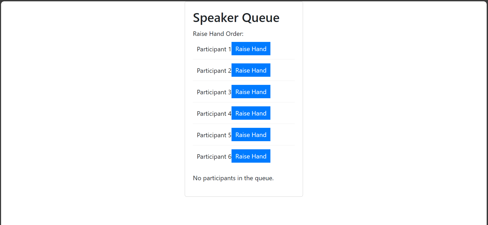

# Speaker Queue 

The Speaker Queue  is a React user interface component that organizes a set of participants who are ready to speak into a queue. It allows participants to raise their hands and be added to the queue.

### Features
Manage a queue of participants with raised hands.
Raise and lower hand functionality for participants.
Display the order in which participants raised their hands.

## Installation

```bash
    npm install
```





